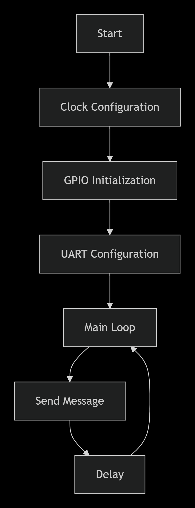

🚀 STM32F103 UART Project with Renode

https://img.shields.io/badge/STM32-F103CB-blue?style=for-the-badge&logo=stmicroelectronics
https://img.shields.io/badge/PlatformIO-IDE-orange?style=for-the-badge&logo=visualstudiocode
https://img.shields.io/badge/Renode-Simulator-purple?style=for-the-badge
https://img.shields.io/badge/C-CMSIS-green?style=for-the-badge&logo=c

Проект по работе с UART на STM32F103 в симуляторе Renode

📋 Оглавление
🎯 Цель проекта

🛠 Технологии

📁 Структура проекта

⚙️ Установка и настройка

🚀 Запуск проекта

🔧 Детали реализации

📊 Результаты

❌ Возможные проблемы

📚 Полезные ссылки

🎯 Цель проекта
Разработка firmware для микроконтроллера STM32F103, реализующего периодическую передачу сообщения через UART интерфейс с последующей симуляцией работы в Renode.

Основные задачи:

✅ Настройка UART на STM32F103

✅ Реализация передачи данных

✅ Сборка проекта в PlatformIO

✅ Симуляция в Renode

✅ Визуализация работы UART

🛠 Технологии
Технология	Версия	Назначение
STM32F103CB	Cortex-M3	Целевой микроконтроллер
PlatformIO	6.1.11	Среда разработки и сборки
Renode	1.16.0	Симулятор embedded систем
CMSIS	5.9.0	Стандарт программирования ARM
VSCode	1.8+	Редактор кода
📁 Структура проекта
text
stm32_uart/
├── 📁 src/
│   └── 🎯 main.c              # Основной код программы
├── 📁 .pio/
│   └── 📁 build/              # Собранные файлы (авто)
├── ⚙️ platformio.ini          # Конфигурация PlatformIO
├── 🔧 renode_config.resc      # Конфигурация Renode
└── 📖 README.md              # Документация
⚙️ Установка и настройка
1. Установка необходимого ПО
📥 PlatformIO
bash
# Устанавливается как расширение в VSCode:
# 1. Открыть VSCode
# 2. Перейти в Extensions (Ctrl+Shift+X)
# 3. Найти "PlatformIO IDE"
# 4. Установить
📥 Renode
bash
# Windows - скачать с официального сайта:
# https://renode.io/

# Linux (Ubuntu/Debian):
wget https://github.com/renode/renode/releases/latest/download/renode_*_amd64.deb
sudo dpkg -i renode_*_amd64.deb
2. Создание проекта
bash
# Создаем папку проекта
mkdir stm32_uart
cd stm32_uart
🚀 Запуск проекта
Шаг 1: Создание конфигурационных файлов
⚙️ platformio.ini
ini
[env:genericSTM32F103CB]
platform = ststm32
board = genericSTM32F103CB
framework = cmsis
build_flags = -DSTM32F103xB
monitor_speed = 115200
🎯 src/main.c
c
#include "stm32f1xx.h"

void delay(void) {
    for(volatile int i = 0; i < 1000000; i++);
}

int main(void) {
    // Включаем тактирование GPIOA и USART2
    RCC->APB2ENR |= RCC_APB2ENR_IOPAEN;
    RCC->APB1ENR |= RCC_APB1ENR_USART2EN;
    
    // Настраиваем PA2 (TX) для USART2
    GPIOA->CRL |= GPIO_CRL_MODE2 | GPIO_CRL_CNF2_1;
    GPIOA->CRL &= ~GPIO_CRL_CNF2_0;
    
    // Настройка USART2
    USART2->BRR = 8000000 / 115200;
    USART2->CR1 = USART_CR1_TE | USART_CR1_UE;
    
    while(1) {
        const char *msg = "hello artem\r\n";
        while(*msg) {
            while(!(USART2->SR & USART_SR_TXE));
            USART2->DR = *msg++;
        }
        delay();
    }
}
🔧 renode_config.resc
resc
using sysbus

mach create
machine LoadPlatformDescription @platforms/cpus/stm32f103.repl

sysbus LoadELF @".pio/build/genericSTM32F103CB/firmware.elf"
showAnalyzer sysbus.usart2
machine Start
Шаг 2: Сборка проекта
bash
# В терминале PlatformIO или командной строке:
platformio run
Ожидаемый вывод:

text
Building in release mode
Linking .pio/build/genericSTM32F103CB/firmware.elf
Checking size .pio/build/genericSTM32F103CB/firmware.elf
========== [SUCCESS] Took X.XX seconds ==========
Шаг 3: Запуск симуляции
bash
renode renode_config.resc

Конфигурация периферии
Параметр	Значение	Описание
Микроконтроллер	STM32F103CB	Cortex-M3, 128KB Flash, 20KB RAM
UART	USART2	Асинхронный режим
Скорость	115200 бод	Baud rate
Пин TX	PA2	Выход передатчика
Тактовая	8 МГц	Внутренний генератор
Алгоритм работы
Инициализация:

Включение тактирования GPIOA и USART2

Настройка PA2 как альтернативной функции

Конфигурация UART (115200 бод, 8 бит, 1 стоп-бит)

Основной цикл:

Отправка строки "hello artem"

Ожидание готовности передатчика

Задержка ~1 секунда

Повтор цикла

📊 Результаты
Ожидаемый вывод в Renode
После успешного запуска в окне Renode появится UART терминал с выводом:

text
hello artem
hello artem  
hello artem
hello artem
...
Визуализация в Renode
https://via.placeholder.com/600x200/4A90E2/FFFFFF?text=UART+Output+in+Renode+Simulator

Характеристики работы:

📡 Период отправки: ~1 секунда

📝 Сообщение: "hello artem"

🔄 Режим: Бесконечный цикл

⚡ Стабильность: Корректная работа в симуляторе

❌ Возможные проблемы
Проблема 1: Ошибка линковки
text
undefined reference to `setup' and `loop'
Решение: Убедиться, что в platformio.ini указан framework = cmsis

Проблема 2: Renode не находит файл
text
Failed to download stm32f4.repl
Решение: Использовать stm32f103.repl вместо stm32f4.repl

Проблема 3: Нет вывода в UART
Решение: Проверить настройки USART и пин TX в коде

Проблема 4: Русские символы в пути
Решение: Размещать проект в пути только с английскими символами

📚 Полезные ссылки
📖 STM32F103 Reference Manual

🌐 PlatformIO Documentation

🔧 Renode Documentation

💻 CMSIS Documentation

Разработано в учебных целях
Студент: [Артем]
Дата: [24.11.2025]

⬆ Наверх

